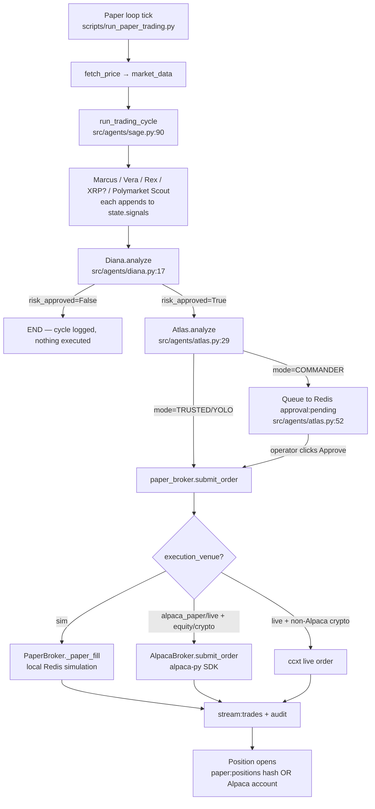
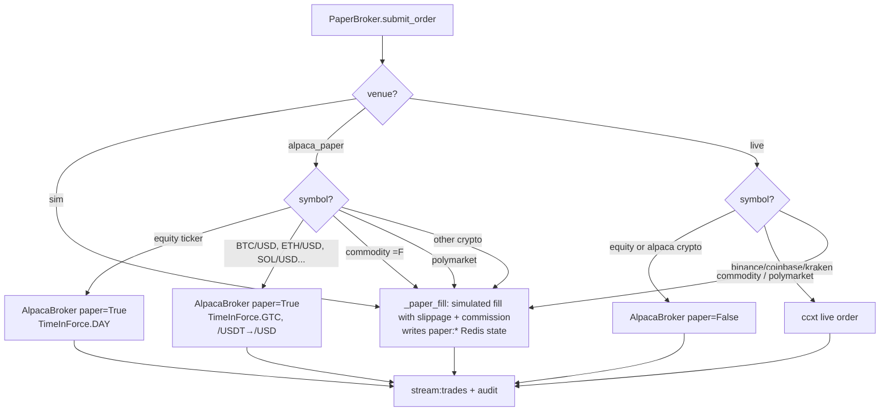

# The Trading Floor — Workflow & Logic Audit

**Purpose.** A complete, honest map of what the system actually does, step by step, so an experienced trading-systems person can validate or poke holes in the design. Every claim here has a file:line reference to the source. If a sentence doesn't have a cite, it's my summary and can be contested.

**Snapshot date.** 2026-04-19. Commit: `c1ef8ca`.

---

## 1. Physical deployment

| Component | Process | What it runs |
|---|---|---|
| `trading-api` | systemd → uvicorn :8000 | FastAPI, the dashboard's only read/write surface. Entry: [src/api/main.py](../src/api/main.py) |
| `trading-frontend` | systemd → `next start :3000` | Next.js 14 App Router. Mission Control UI. |
| `trading-paper` | systemd → `python scripts/run_paper_trading.py` | The signal-generation loop. Runs four concurrent symbol loops at different cadences (XRP 2m, crypto tier-1 5m, tier-2 10m, commodities 15m) plus a 30m macro refresh. [scripts/run_paper_trading.py:199](../scripts/run_paper_trading.py) |
| `trading-monitors` | systemd → `python scripts/run_monitors.py` | Two coroutines in one process: position monitor (5s) and risk monitor (30s). Owns exits, kill-switch auto-trigger, ELO updates. |
| Redis (Docker) | `localhost:6379` | State + streams: paper state, agent state, kill switch, config, consumer groups. Topology: [src/streams/topology.py](../src/streams/topology.py) |
| Postgres/Timescale (Docker) | `localhost:5432` | OHLCV persistence (feed ingestor). Not on the hot path. |
| Cloudflare Tunnel | `cloudflared` systemd | `https://tradingfloor.world` → frontend :3000, `https://api.tradingfloor.world` → api :8000. |

> **Note for the expert.** A second scheduler exists at [src/schedulers/cycle_runner.py](../src/schedulers/cycle_runner.py) — that's the Docker-compose `scheduler` service entrypoint. The droplet does **not** run it; droplet uses `run_paper_trading.py` via systemd. Both call `sage.run_trading_cycle(symbol, market_data)` so the downstream logic is identical, but cadences and universe differ. Worth unifying.

---

## 2. The agent roster

Defined in [src/agents/](../src/agents/). Each subclasses `BaseAgent` at [src/agents/base.py:56](../src/agents/base.py).

| Agent | Role | What it contributes |
|---|---|---|
| **Marcus** | Fundamentals | Emits LONG/SHORT/NEUTRAL + confidence. |
| **Vera** | Technical | Emits LONG/SHORT/NEUTRAL + confidence. |
| **Rex** | Sentiment | Emits LONG/SHORT/NEUTRAL + confidence. |
| **XRP Analyst** | XRP-specific | Only runs for XRP symbols ([src/agents/sage.py:41](../src/agents/sage.py)). |
| **Polymarket Scout** | Prediction-market context | Augments state with polymarket signals. |
| **Diana** | "Risk Manager" | Consensus gate. See §4 — her risk check is shallower than the name suggests. |
| **Atlas** | Execution | Picks buy/sell/queue-for-approval based on autonomy mode. |
| Bull / Bear / Nova | Not wired into the current `sage` graph | Present in code but not in the LangGraph at [src/agents/sage.py:54](../src/agents/sage.py). |
| Scout / Sage | Supervisor / opportunities | Sage is the graph builder itself, not a node. |

The graph edges ([src/agents/sage.py:70](../src/agents/sage.py)):

```
entry → marcus → vera → rex → {xrp_analyst if XRP else polymarket_scout}
      → polymarket_scout → diana → {atlas if approved else END} → atlas → END
```

---

## 3. The signal lifecycle (one cycle)

Every N minutes per symbol, `run_trading_cycle(symbol, market_data)` fires and walks the graph. High-level:



Every agent call is wrapped in `analyze_with_heartbeat` ([src/agents/base.py:189](../src/agents/base.py)) which posts an `agent:state:*` heartbeat to Redis so the MC dashboard shows liveness.

**State shape.** `AgentState` is a TypedDict carrying `market_data`, `signals`, `risk_approved`, `final_decision`, `confidence`, `reasoning`, `messages`. Each agent appends to `signals` and may set `reasoning`.

---

## 4. Risk gating — what Diana actually checks

[src/agents/diana.py:17](../src/agents/diana.py):

```
approved = avg_confidence >= 0.5  AND  max(longs, shorts) / total >= 0.5
```

That is the entire risk check that gates execution. No portfolio-size check. No concentration. No correlation. No daily-loss check. No Kelly sizing.

**There is a `RiskEngine` class at [src/execution/risk.py:18](../src/execution/risk.py) with a `check_trade(...)` method that does size capping and daily-loss enforcement, but grep confirms it's never called from the agent path.** It's dead code. Flag for the expert: either wire it in before Diana's return, or delete it.

The actual multi-layer risk controls that do fire live in `risk_monitor` (§8) and `VolatilityPositionSizer` (§6). They run out-of-band, not as part of Diana's approval.

---

## 5. Autonomy modes — COMMANDER / TRUSTED / YOLO

Driven by Redis `config:system.autonomy_mode`. Atlas reads it per-cycle ([src/agents/atlas.py:18](../src/agents/atlas.py)).

- **COMMANDER.** Atlas enqueues an approval packet into Redis hash `approval:pending` ([src/agents/atlas.py:52](../src/agents/atlas.py)). Nothing executes until the operator hits Approve on the MC banner → `POST /api/orders/approve/{signal_id}` ([src/api/routers/orders.py:159](../src/api/routers/orders.py)) → `paper_broker.submit_order`.
- **TRUSTED / YOLO.** Atlas calls `paper_broker.submit_order` directly ([src/agents/atlas.py:75](../src/agents/atlas.py)).

Settings from [CLAUDE.md](../CLAUDE.md):
| Mode | Max risk/trade | Max daily loss | Notes |
|---|---|---|---|
| COMMANDER | 2% | 5% | Every trade needs a click. |
| TRUSTED | 3% | 7% | Auto-execute above 75% confidence. |
| YOLO | 5% | 12% | Full autonomous; typed-confirm to enable. |

> **Gap for the expert.** The "75% confidence" threshold and the per-mode risk caps in CLAUDE.md are **documented but not enforced in code.** Autonomy only gates "does Atlas queue or auto-execute?" — the risk caps listed per mode are not read anywhere. Diana's check is a static 50% regardless of mode.

---

## 6. Position sizing

Live path: `VolatilityPositionSizer` at [src/execution/position_sizer.py:45](../src/execution/position_sizer.py). Called inside `PaperBroker._paper_fill` at [src/execution/broker.py:443](../src/execution/broker.py):

```
size = (portfolio_value × target_risk_pct) / (price × annualized_vol)
size_usd ≤ 1% × 24h_volume      # liquidity cap
```

Volatility read from recent entries in `stream:market_data`; defaults to 30% annualized when history is thin.

**Two important caveats:**

1. The sizer only runs on the **sim path** (`_paper_fill`). On the Alpaca path we pass Atlas's quantity straight through to Alpaca. Alpaca will apply its own margin check on `buying_power`, but the volatility-parity logic is skipped entirely. Today that usually means Atlas passes `quantity=0.0` and we rely on Alpaca rejecting — which is not the behavior anyone wants. **This is the top gap to fix.**
2. `target_risk_pct` is read from `settings.max_risk_per_trade` (2% default from [src/core/config.py](../src/core/config.py)), not from the autonomy-mode table.

---

## 7. Execution routing — sim / alpaca_paper / live

Venue selector added on 2026-04-19 at [src/execution/broker.py:89](../src/execution/broker.py). Redis key: `config:system.execution_venue`.



Fallback: if Alpaca credentials are missing or the client fails, we silently drop back to sim. This is logged (`alpaca_broker_unavailable_fallback_sim`) but will still take the trade as a sim fill, which could surprise an operator. Flag for review.

---

## 8. Position lifecycle — monitor, exit, P&L, ELO

Once a position exists (in Alpaca or sim), two independent loops manage it:

### Position monitor — [src/execution/position_monitor.py](../src/execution/position_monitor.py)

Runs every **5 seconds** (`MONITOR_INTERVAL`). For each open position:

1. Fetch live price.
2. If `pnl_pct ≥ 5%` → set trailing stop to breakeven ([position_monitor.py:47](../src/execution/position_monitor.py)).
3. Effective stop = `max(static_stop, trailing_stop)`.
4. If `price ≤ effective_stop` → exit reason `"stop"`.
5. If `price ≥ take_profit` → exit reason `"target"`.
6. Exit fires `paper_broker.submit_order(side="SELL", ...)` ([position_monitor.py:83](../src/execution/position_monitor.py)) → publishes `stream:pnl` + audit → updates ELO.

Defaults when position has no explicit levels: `-3% stop`, `+6% target` ([position_monitor.py:25](../src/execution/position_monitor.py)).

### Risk monitor — [src/execution/risk_monitor.py](../src/execution/risk_monitor.py)

Runs every **30 seconds**. Computes portfolio-wide metrics, writes `risk:metrics` Redis hash (which `/api/execution/risk-metrics` returns to the dashboard), and:

- **Auto daily-loss kill switch** at [risk_monitor.py:198](../src/execution/risk_monitor.py). If `abs(drawdown_pct) ≥ settings.max_daily_loss` (5%), activates kill switch.
- **Concentration alert** at [risk_monitor.py:220](../src/execution/risk_monitor.py). Emits an alert (not an exit) if any position > 3 × max_risk_per_trade = 6% of portfolio.
- **Daily-P&L rollover at UTC midnight** ([risk_monitor.py:47](../src/execution/risk_monitor.py)).

### Kill switch

State in Redis keys `kill_switch:active|reason|activated_at` ([src/core/security.py](../src/core/security.py)). Two activation paths:

- Manual via `POST /api/orders/kill` ([orders.py:192](../src/api/routers/orders.py)).
- Auto from risk_monitor on daily-loss breach.

On activation, position_monitor calls `_flatten_all_for_kill_switch()` ([position_monitor.py:165](../src/execution/position_monitor.py)) → closes every position via `_exit_position(..., reason="kill_switch")`. No new orders are accepted while active (orders router returns 503).

> **Critical gap introduced 2026-04-19.** risk_monitor and the kill-switch flatten path both read/write through `paper_broker.get_positions()` / `paper_broker.flatten_all()` — **sim state only.** When `execution_venue=alpaca_paper` or `live`:
>
> - Daily-loss auto-trigger won't fire on real Alpaca P&L.
> - Kill switch `flatten_all()` won't close Alpaca positions.
> - Concentration alerts are calculated from whatever's in `paper:positions`, which in Alpaca mode is empty or stale.
>
> This must be fixed before the operator trusts the `alpaca_paper` venue for anything beyond smoke tests. Cleanest approach: make risk_monitor venue-aware the same way `/api/execution/*` is, and give `AlpacaBroker` a `flatten_all()` that iterates `get_all_positions()` and submits closing orders.

---

## 9. ELO rating system

Purpose: rank which analysts' signals translate into money. Stored at Redis `agent:state:{id}.elo` (default 1200).

**Contributor recording** — [src/agents/atlas.py:86](../src/agents/atlas.py). When a BUY fills, Atlas grabs every agent in `state.signals` whose `direction` matched the final decision and whose `confidence ≥ 0.55`, and adds them to a Redis set `paper:position:{symbol}:contributors`. Duplicate adds to the same pending approval are also recorded on `approve_signal` ([orders.py:176](../src/api/routers/orders.py)).

**Outcome application** — [src/execution/position_monitor.py:113](../src/execution/position_monitor.py). When a position exits:

```
if pnl_pct > +0.1%:  delta = +32   outcome="win"
if pnl_pct < -0.1%:  delta = -32   outcome="loss"
else:                delta =  0    outcome="draw"

for agent in contributors:
    agent.elo += delta
    agent.trades_{outcome} += 1
```

K-factor bumped from 16 → 32 on 2026-04-19 (`c1ef8ca`) to make bad trades move the rating more visibly.

> **Gaps for the expert:**
> 1. **BUY-only bias.** Contributors are recorded only on BUY fills. Profitable SHORT calls never rate their bearish analysts. [atlas.py:86](../src/agents/atlas.py).
> 2. **Manual exits bypass ELO.** Only stop/target/kill_switch exits call `_update_agent_elos`. A SELL submitted via `/api/orders/submit` or manual script closes the position but skips the ELO update. The contributor set lingers in Redis until the next same-symbol position opens.
> 3. **Threshold inconsistency.** Atlas filters contributors at `confidence ≥ 0.55`; Diana approves at `avg_confidence ≥ 0.50`. An agent at 0.52 can be part of an approved trade but never get credited or dinged.
> 4. **Flat K.** No expected-outcome adjustment. Two 1200-rated agents on the same trade each move ±32 regardless of how certain or uncertain the signal was. Consider `K × confidence` or `K × |pnl_pct|` once baseline works.
> 5. **No decay.** A stale win rating persists forever. Consider a per-N-trade half-life or rolling window so agents have to re-earn reputation.

---

## 10. Audit + observability

- **Every state-changing action writes to `stream:audit`** (the Redis Stream) via `produce_audit(...)` in [src/streams/producer.py](../src/streams/producer.py). Consumer group `cg:audit_writer` drains it to Postgres for append-only history.
- **Every trade writes to `stream:trades`.** Two consumers: WebSocket broadcast for MC + audit writer.
- **Every P&L change writes to `stream:pnl`.** Risk monitor captures a snapshot every 30s into `pnl:snapshots` (list, 1440 deep = 12h history).
- **Every agent heartbeat writes `agent:state:{id}.last_heartbeat`.** No longer writes `elo` (was stomping the real value until `c6e27d9`).
- **Phoenix / OTLP** is configured in CLAUDE.md but I haven't verified the traces are actually flowing. Worth checking on the droplet.

---

## 11. What I'd specifically ask an expert to weigh in on

Ordered by severity of my concern:

1. **Diana is not a risk manager.** She's a consensus gate (50% avg confidence + 50% direction agreement). Is that enough? What additional pre-trade checks belong here — portfolio Greeks, correlation to existing book, time-of-day, regime awareness, news-blackout windows?

2. **The Alpaca venue bypasses our position sizer.** When venue is `alpaca_paper` or `live`, `VolatilityPositionSizer` never runs; Alpaca just gets whatever quantity Atlas passed. What's the right order of operations: size → risk-approve → submit, or risk-approve at a target notional and let the sizer pick units inside the approved band?

3. **Kill switch + risk_monitor are sim-only.** Described in §8 above. Biggest live-safety gap.

4. **Only 5 pre-trade agents inform Diana** (marcus, vera, rex, xrp_analyst?, polymarket_scout). Bull/Bear/Nova exist in the repo but aren't wired. Is the current roster sufficient coverage of fundamental / technical / sentiment / regime?

5. **Stop/target levels come from agent output, fall back to −3%/+6%.** Are those sensible defaults across asset classes? (BTC intraday realized vol is ~3%, so a default 3% stop will cash out on normal noise. Equities intraday vol is much tighter.)

6. **ELO weights every approved agent the same.** A signal cluster of 5 bulls rates all 5 equally, even if one carried the thesis. Could we weight by `confidence` at submission time?

7. **No drawdown ceiling per agent.** If Marcus hits 5 losses in a row, nothing stops him from continuing to participate. Should low-ELO agents be auto-suspended?

8. **No correlation check across open positions.** Buying SPY + QQQ + NVDA in the same cycle books effectively one leveraged long on the same beta. Sizer treats them as independent.

9. **Scheduler universe is hardcoded in [run_paper_trading.py:25](../scripts/run_paper_trading.py)**, not read from `config:assets:enabled`. The MC Settings page lets you toggle assets but the signal loop ignores the toggle.

10. **`cycle_runner.py` and `run_paper_trading.py` both exist, call the same graph, but at different cadences with different universes.** Risk of divergence — we should pick one.

---

## 12. Related reading

- Agent graph: [src/agents/sage.py](../src/agents/sage.py)
- Risk checks (agent path): [src/agents/diana.py](../src/agents/diana.py)
- Risk checks (out-of-band): [src/execution/risk_monitor.py](../src/execution/risk_monitor.py)
- Dead-code risk engine: [src/execution/risk.py](../src/execution/risk.py)
- Broker routing: [src/execution/broker.py](../src/execution/broker.py)
- Alpaca adapter: [src/execution/alpaca_broker.py](../src/execution/alpaca_broker.py)
- Position exits + ELO: [src/execution/position_monitor.py](../src/execution/position_monitor.py)
- Sizing: [src/execution/position_sizer.py](../src/execution/position_sizer.py)
- Kill switch: [src/core/security.py](../src/core/security.py)
- Approval flow: [src/api/routers/orders.py](../src/api/routers/orders.py)
- Streams registry: [src/streams/topology.py](../src/streams/topology.py)
- Paper scheduler: [scripts/run_paper_trading.py](../scripts/run_paper_trading.py)
